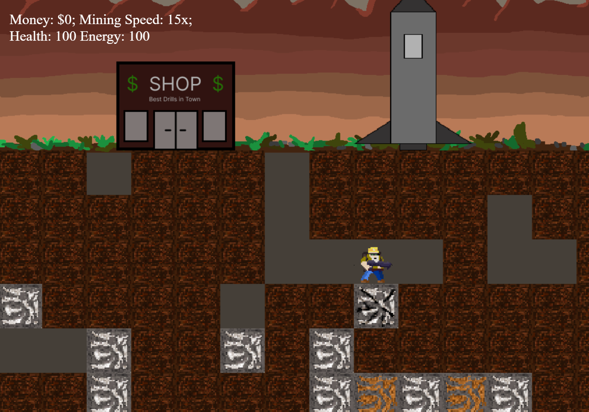
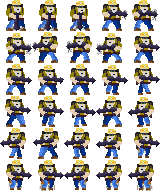
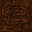
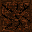
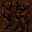
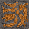
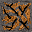
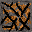
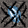

# 🎮 **Game Title** 

> **Short Pitch**: A brief and catchy description of your game. Highlight the concept, genre, and key features.
> 
> *Example:* "Explore an alien planet in this retro-inspired platformer where gravity is your greatest ally—or enemy!"

---

## 🌐 **Play the Game**
[Click here to play the game!](https://kornti-debug.github.io/Drillworld/)

---

## 📸 **Screenshots**

### Main Gameplay:

  
  
This is the gameplay of Drillworld! A 2D-Mining game where you need to collect ores, sell them, and build a rocket to leave the planet!

---

### Menu and UI:

  
  
Menu and Interface

---

### Shop Interface:

  
  
The Interface of the shop

---

## 🎨 **Spritesheets**
Below are the sprites used to create characters and objects in the game:

### Player Character:

  
  
Player character animations. This is the spritesheet of the protagonist Drillen Digman!

---

### Ore Sprites

  
  
  
  
  
  
  
  
  
  
  
  
  
Ore Sprites

---

## ✍️ **Reflection**

### What went well:
- **Creative Design:**
The design was inspired by the game Motherload. A 2D mining game. The style was inspired by Muten Roshi and Terminator. The sprites were fun to design and a lot of creativity went into designing them

- **Core Mechanics:** The gravity and movement mechanic were challenging to make. In the end it worked out, but there are still some minor bugs or lets say features 😉

### Challenges:
- **Time Constraints:** Implementing all the features we envisioned wasn’t possible due to the limited timeframe.
- **Bug Fixes:** Handling collisions and edge cases for gravity mechanics was tricky. Also the jetpack movement where challenging to make, because you I also needed to consider how the gravity is applied when using the jetpack.

### Lessons Learned:
- **Prototyping Matters:** Testing early prototypes helped refine the core mechanics quickly.
- **Keep it Simple:** Focusing on one unique mechanic instead of multiple features made the game more polished.
